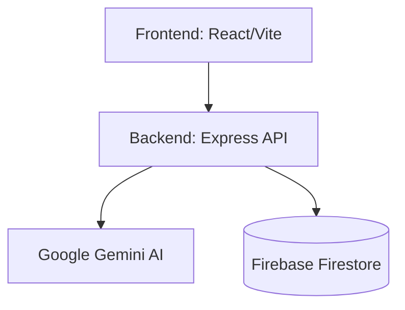

# Architecture

This document describes the high-level architecture of Code Pulse.

## System Overview

Code Pulse follows a standard client-server architecture:

### Components

- **Frontend**: Single Page Application displaying dashboards, code reviews, and historical visualizations.
- **Backend API**: Processes analysis requests, schedules scans, queries GitHub APIs, and formats prompts for the Gemini model.
- **Firestore**: Stores user settings, repository metadata, past review results, and historical pulse trends.
- **Gemini integration**: Processes prompts for static review, pattern analysis, and quality auditing.
